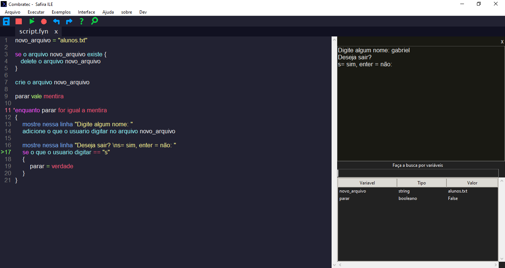

# Introdução
A Safira é uma linguagem de programação focada em lógica com o objetivo de amortecer o impacto do primeiro contato com o mundo da programação, oferecendo uma interface simples, intuitiva e uma codificação natural, focada em lógica

Esta é a Safira


A Safira é focada apenas na estrutura básica e em pequenos scripts. Não é recomendado o uso da safira para projetos com muitas linhas de código, sendo altamente recomendado a variação de comandos para se aproximar da primeira linguagem de programação que o aluno vai de fato aprender.

Nos primeiro contato com a Safira, é recomendado o uso de comandos no idioma nativo, como o português, exemplo:

Se o foco for ensinar linguagem Python para um grupo de pessoas, é recomendado começar com comandos bem simples, como:

    nome vale o que o usuario digitar

    se nome for igual a "Gabriel" entao {
        mostre "Olá Gabriel"
    } 

Posteriormente, é recomendado a variação, mesmo que seja comando por comando, no ritmo do aluno para a seguinte codificação,

    nome = input

    if nome == "Gabriel" {
        print "Olá Gabriel"
    }

Perceba que a Safira está muito mais próximo do Python agora


    nome = input()

    if nome == "Gabriel":
        print("Olá Gabriel")


Desta forma, a complexidade da linguagem, seja ela qual for, é reduzida e o conceito será aprendido com mais facilidade. A Safira tem mais de 30 comandos, você pode conferir eles na aba "Exemplos" da IDE ou no [blog](https://safiraide.blogspot.com/p/comandos.html).
 
É assim que fica a codificação de um programa maior na Safira.


# Como executar os arquivos do repositório
1. Baixe e instale o Python3.8
2. Adicione o Python ao Path
3. Instale os pacotes necessários
  ```shell
    python3.8 -m pip install -r requeriments.txt
  ```
4. Execute o arquivo safira.py

-------------------------------------

# Como programar em Safira?
Confira os principais comandos aqui: https://safiraide.blogspot.com/p/comandos.html

-------------------------------------

# Download
* [Windows 10](https://safiraide.blogspot.com/p/downloads.html)
* [Linux Mint](https://safiraide.blogspot.com/p/downloads.html)
* [Ubuntu](https://safiraide.blogspot.com/p/downloads.html)

# Outros Links
* [Blog](https://safiraide.blogspot.com/)
* [Facebook](https://www.facebook.com/safiraide/)
